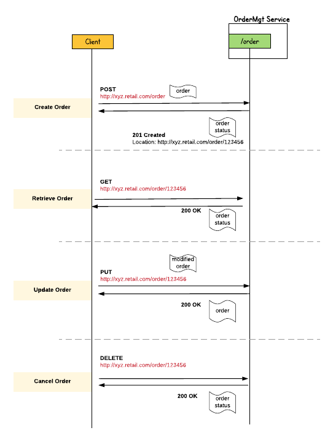

# RESTful Service  

In this guide you will learn about building a comprehensive RESTful Web Service using Ballerina. 


## <a name="what-you-build"></a> What you’ll build 
To understanding how you can build a RESTful web service using Ballerina, let’s consider a real world use case of an order management scenario of an online retail application. 
We can model the order management scenario as a RESTful web service; 'OrderMgtService',  which accepts different HTTP request for order management tasks such as order creation, retrieval, updating and deletion.
The following figure illustrates all the required functionalities of the OrderMgt RESTful web service that we need to build. 




- **Create Order** : To place a new order you can use the HTTP POST message that contains the order details, which is sent to the URL (http://xyz.retail.com/order).The response from the service contains an HTTP 201 Created message with the location header pointing to the newly created resource (http://xyz.retail.com/order/123456). 
- **Retrieve Order** : You can retrieve the order details by sending an HTTP GET request to the appropriate URL which includes the order ID. (e.g. http://xyz.retail.com/order/<orderId>)
- **Update Order** : You can update an existing order by sending a HTTP PUT request with the content for the updated order. 
- **Delete Order** : An existing order can be deleted by sending a HTTP DELETE request to the specific URL (e.g. http://xyz.retail.com/order/<orderId>). 


## <a name="pre-req"></a> Prerequisites
 
- JDK 1.8 or later
- Ballerina Distribution (Install Instructions:  https://ballerinalang.org/docs/quick-tour/quick-tour/#install-ballerina)
- A Text Editor or an IDE 

Optional Requirements
- Docker (Follow instructions in https://docs.docker.com/engine/installation/)
- Ballerina IDE plugins. ( Intellij IDEA, VSCode, Atom)
- Testerina (Refer: https://github.com/ballerinalang/testerina)
- Container-support (Refer: https://github.com/ballerinalang/container-support)
- Docerina (Refer: https://github.com/ballerinalang/docerina)

## <a name="developing-service"></a> Developing the RESTFul service 

We can model the OrderMgt RESTful service using Ballerina services and resources constructs. 

1. We can get started with a Ballerina service; 'OrderMgtService', which is the RESTful service that serves the order management request. OrderMgtService can have multiple resources and each resource is dedicated for a specific order management functionality.
2. You can decide the package structure for the service and then create the service in the corresponding directory structure. For example, suppose that you are going to use the package name 'guide.restful_service', then you need to create the following directory structure and create the service file using the text editor or IDE that you use. 

```
restful-service
   └── guide
       └── restful_service
           └── OrderMgtService.bal  
```
2. You can add the content to your Ballerina service as shown below. In that code segment you can find the implementation of the service and resource skeletons of 'OrderMgtService'. 
For each order management operation, there is a dedicated resource and inside each resource we can implement the order management operation logic. 
The service is annotated with the base path for the service and each resource has path and HTTP methods based filtering, so that we can selectively route the messages through theses resources. 

##### OrderMgtService.bal
```ballerina
package guide.restful_service;

import ballerina.net.http;

@http:configuration {basePath:"/ordermgt"}
service<http> OrderMgtService {


    @http:resourceConfig {
        methods:["GET"],
        path:"/order/{orderId}"
    }
    resource findOrder (http:Connection conn, http:InRequest req, string orderId) {
        // Implementation 
    }

    @http:resourceConfig {
        methods:["POST"],
        path:"/order"
    }
    resource addOrder (http:Connection conn, http:InRequest req) {
        // Implementation 
    }

    @http:resourceConfig {
        methods:["PUT"],
        path:"/order/{orderId}"
    }
    resource updateOrder (http:Connection conn, http:InRequest req, string orderId) {
        // Implementation 
    }

    @http:resourceConfig {
        methods:["DELETE"],
        path:"/order/{orderId}"
    }
    resource cancelOrder (http:Connection conn, http:InRequest req, string orderId) {
        // Implementation    
    }
}


```


3. You can implement the business logic of each resources as per your requirements. For simplicity we have used an in-memory map to keep all the order details. You can find the full source code of the OrderMgtService below. In addition to the order processing logic, we have also manipulated some HTTP status codes and headers whenever required.  


##### OrderMgtService.bal
```ballerina
package guide.restful_service;

import ballerina.net.http;

@http:configuration {basePath:"/ordermgt"}
service<http> OrderMgtService {

    // Add some sample orders to the orderMap during the startup.
    map ordersMap = populateSampleOrders();

    @http:resourceConfig {
        methods:["GET"],
        path:"/order/{orderId}"
    }
    resource findOrder (http:Connection conn, http:InRequest req, string orderId) {
        json payload;
        payload, _ = (json)ordersMap[orderId];

        http:OutResponse response = {};
        if (payload == null) {
            payload = "Order : " + orderId + " cannot be found.";
        }
        response.setJsonPayload(payload);
        _ = conn.respond(response);
    }

    @http:resourceConfig {
        methods:["POST"],
        path:"/order"
    }
    resource addOrder (http:Connection conn, http:InRequest req) {
        json orderReq = req.getJsonPayload();
        var orderId, _ = (string) orderReq.Order.ID;
        ordersMap[orderId] = orderReq;

        // Create response message
        json payload = {status:"Order Created.", orderId:orderId};
        http:OutResponse response = {};
        response.setJsonPayload(payload);

        // Set 201 Created status code and 'Location' header to locate the newly added order.
        response.statusCode = 201;
        response.setHeader("Location", "http://localhost:9090/ordermgt/order/" + orderId);

        _ = conn.respond(response);
    }

    @http:resourceConfig {
        methods:["PUT"],
        path:"/order/{orderId}"
    }
    resource updateOrder (http:Connection conn, http:InRequest req, string orderId) {

        json newOrder = req.getJsonPayload();

        json existingOrder;
        existingOrder, _ = (json)ordersMap[orderId];

        // Updating existing order with new order attributes
        if (existingOrder != null) {
            existingOrder.Order.Name = newOrder.Order.Name;
            existingOrder.Order.Description = newOrder.Order.Description;
            ordersMap[orderId] = existingOrder;
        } else {
            existingOrder = "Order : " + orderId + " cannot be found.";
        }

        http:OutResponse response = {};
        response.setJsonPayload(existingOrder);
        _ = conn.respond(response);
    }

    @http:resourceConfig {
        methods:["DELETE"],
        path:"/order/{orderId}"
    }
    resource cancelOrder (http:Connection conn, http:InRequest req, string orderId) {
        http:OutResponse response = {};
        ordersMap.remove(orderId);
        json payload = "Order : " + orderId + " removed.";
        response.setJsonPayload(payload);
        _ = conn.respond(response);
    }

}


// Add some sample orders for testing purposes.
function populateSampleOrders () (map orders) {
    orders = {};
    json order_1 = {"Order":{"ID":"123000", "Name":"ABC_1", "Description":"Sample order."}};
    json order_2 = {"Order":{"ID":"123001", "Name":"ABC_2", "Description":"Sample order."}};
    json order_3 = {"Order":{"ID":"123002", "Name":"ABC_3", "Description":"Sample order."}};
    orders["123000"] = order_1;
    orders["123001"] = order_2;
    orders["123002"] = order_3;

    println("Sample orders are added.");
    return orders;
}


```

4. With that we've completed the development of OrderMgtService. 


## <a name="testing"></a> Testing 
(Work in progress) 

### <a name="invoking"></a> Invoking the RESTful service 

You can test the functionality of the OrderMgt RESTFul service by sending HTTP request for each order management operation. For example, we have used the curl commands to test each operation of OrderMgtService as follows. 

**Create Order** 
```
curl -v -X POST -d '{ "Order": { "ID": "100500", "Name": "XYZ", "Description": "Sample order."}}' \
 "http://localhost:9090/ordermgt/order" -H "Content-Type:application/json"

Output :  
< HTTP/1.1 201 Created
< Content-Type: application/json
< Location: http://localhost:9090/ordermgt/order/100500
< Transfer-Encoding: chunked
< Server: wso2-http-transport
< 
* Connection #0 to host localhost left intact
{"status":"Order Created.","orderId":"100500"}[
 
```

**Retrieve Order** 
```
curl "http://localhost:9090/ordermgt/order/100500" 

Output : 
{"Order":{"ID":"100500","Name":"XYZ","Description":"Sample order."}}


```
**Update Order** 
```
curl -X PUT -d '{ "Order": {"Name": "XYZ", "Description": "Updated order."}}' \
 "http://localhost:9090/ordermgt/order/100500" -H "Content-Type:application/json"

Output: 
{"Order":{"ID":"100500","Name":"XYZ","Description":"Updated order."}}[
```

**Cancel Order** 
```
curl -X DELETE "http://localhost:9090/ordermgt/order/100500"

Output:
"Order : 100500 removed."
```

### <a name="unit-testing"></a> Writing Unit Tests 

<Work in progress> 


## <a name="deploying-the-scenario"></a> Deployment

Once you are done with the development, you can deploy the service using any of the methods that we listed below. 

### <a name="deploying-on-locally"></a> Deploying Locally
You can deploy the RESTful service that you developed above, in your local environment. You need to have the Ballerina installation in you local machine and simply point to the <ballerina>/bin/ballerina binary to execute all the following steps.  

1. As the first step you can build a Ballerina executable archive (.balx) of the service that we developed above, using the following command. It points to the directory structure of the service that we developed above and it will create an executable binary out of that. 

```
$ballerina build guide/restful_service
```

2. Once the restful_service.balx is created, you can run that with the following command. 

```
ballerina run restful_service.balx 
```

3. The successful execution of the service should show us the following output. 
```
$ballerina run restful_service.balx 
ballerina: deploying service(s) in 'restful_service.balx'
Sample orders are added.
 
```


### <a name="deploying-on-docker"></a> Deploying on Docker
(Work in progress) 

### <a name="deploying-on-k8s"></a> Deploying on Kubernetes
(Work in progress) 
