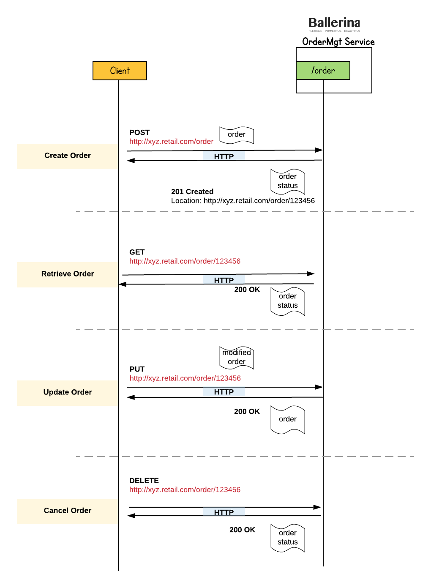

# RESTful Service 

Building a RESTful web service using Ballerina. 


ballerina build guide/restful_service
ballerina run restful_service.balx 


## <a name="What-we-ll-build"></a> What we'll build
We’ll build a Hello service that will accept HTTP GET requests at:





## <a name="what-we-ll-need"></a> Before beginning:  What we'll need

## <a name="building-the-scenario"></a> Building the Scenario


Sample code

##### helloService.bal
```ballerina
package guide.restful_service;

import ballerina.net.http;

@http:configuration {basePath:"/ordermgt"}
service<http> OrderMgtService {

    map ordersMap = populateSampleOrders();

    @http:resourceConfig {
        methods:["GET"],
        path:"/order/{orderId}"
    }
    resource findOrder (http:Connection conn, http:InRequest req, string orderId) {
        json payload;
        payload, _ = (json)ordersMap[orderId];

        http:OutResponse response = {};
        if (payload == null) {
            payload = "Order : " + orderId + " cannot be found.";
        }
        response.setJsonPayload(payload);
        _ = conn.respond(response);
    }

    @http:resourceConfig {
        methods:["POST"],
        path:"/order"
    }
    resource addOrder (http:Connection conn, http:InRequest req) {
        json orderReq = req.getJsonPayload();
        var orderId, _ = (string) orderReq.Order.ID;
        ordersMap[orderId] = orderReq;

        // Create response message
        json payload = {status:"Order Created.", orderId:orderId};
        http:OutResponse response = {};
        response.setJsonPayload(payload);
        response.statusCode = 201;
        response.setHeader("Location", "http://localhost:9090/ordermgt/order/" + orderId);

        _ = conn.respond(response);
    }

    @http:resourceConfig {
        methods:["PUT"],
        path:"/order/{orderId}"
    }
    resource updateOrder (http:Connection conn, http:InRequest req, string orderId) {

        json newOrder = req.getJsonPayload();

        json existingOrder;
        existingOrder, _ = (json)ordersMap[orderId];

        http:OutResponse response = {};
        if (existingOrder == null) {
            existingOrder = "Order : " + orderId + " cannot be found.";
        }

        existingOrder.Order.Name = newOrder.Order.Name;
        existingOrder.Order.Description = newOrder.Order.Description;

        ordersMap[orderId] = existingOrder;

        response.setJsonPayload(existingOrder);
        _ = conn.respond(response);
    }

    @http:resourceConfig {
        methods:["DELETE"],
        path:"/order/{orderId}"
    }
    resource cancelOrder (http:Connection conn, http:InRequest req, string orderId) {
        http:OutResponse response = {};
        ordersMap.remove(orderId);
        json payload = "Order : " + orderId + " removed.";
        response.setJsonPayload(payload);
        _ = conn.respond(response);
    }

}


function populateSampleOrders () (map orders) {
    orders = {};
    json order_1 = {"Order":{"ID":"123000", "Name":"ABC_1", "Description":"Sample order."}};
    json order_2 = {"Order":{"ID":"123001", "Name":"ABC_2", "Description":"Sample order."}};
    json order_3 = {"Order":{"ID":"123002", "Name":"ABC_3", "Description":"Sample order."}};
    orders["123000"] = order_1;
    orders["123001"] = order_2;
    orders["123002"] = order_3;

    println("Sample orders are added.");
    return orders;
}

```

## <a name="running-the-scenario"></a> Running the Scenario


curl -X POST -d '{ "Order": { "ID": "100500", "Name": "XYZ", "Description": "Sample order."}}'  "http://localhost:9090/ordermgt/order" -H "Content-Type:application/json"

curl "http://localhost:9090/ordermgt/order/100500" 

curl -X PUT -d '{ "Order": {"Name": "XYZ", "Description": "Updated order."}}'  "http://localhost:9090/ordermgt/order/100500" -H "Content-Type:application/json"

curl -X DELETE "http://localhost:9090/ordermgt/order/100500"

### <a name="invoking-the-service"></a> Invoking the Service


### <a name="invoking-the-service"></a> Unit Testing


## <a name="deploying-the-scenario"></a> Deploying the Scenario

## <a name="deploying-the-scenario"></a> Deploying the Scenario
### <a name="deploying-on-docker"></a> Deploying on Docker
### <a name="deploying-on-k8s"></a> Deploying on Kubernetes


